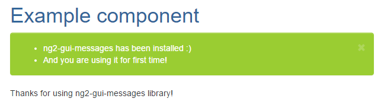

# ng2-gui-messages

## Contents
* [Overview]
* [Installation]
* [Usage]
  + [How to use the Component]
  + [How to use the Service]
* [Development]
* [Author]
* [License]

## Overview
ng2-gui-messages is an Angular 2 library for managing the feedback messages to the user that will save your day. It can handle 4 different categories of messages in separate boxes: Success, Error, Warning and Info, and has the ability to display them in the current page or in the next one to be routed.

## Installation

To install this library, run:

```bash
$ npm install ng2-gui-messages --save
```

and then from your Angular `AppModule`:

```typescript
import { BrowserModule } from '@angular/platform-browser';
import { NgModule } from '@angular/core';

import { AppComponent } from './app.component';

// Import ng2-gui-messages library
import { MessageModule, MessageService } from 'ng2-gui-messages';

@NgModule({
  declarations: [
    AppComponent
  ],
  imports: [
    BrowserModule,

    // Specify ng2-gui-messages library module as an import
    MessageModule
  ],
  // Specify ng2-gui-messages library service as a provider
  providers: [MessageService],
  bootstrap: [AppComponent]
})
export class AppModule { }
```
## Usage

Once the library is imported, you can use its component and service. The component is the one who display the messages to the user, and the service is where the messages have to be added.

### How to use the Component

In each template that you want to display messages to the user, just add the ng2-gui-messages component and will handle it for you!

#### Default CSS classes
To use the styles and classes made by us, just use:

```xml
<!-- You can use the messages component in app.component.html -->
<h1>
  {{title}}
</h1>
<messages-component></messages-component>
```
#### Custom CSS classes
To use your custom CSS classes, declare the component in the template specifying your classes for the boxes that you want to be custom. The error box will use "errorClasses", the info box will use "infoClasses", the warning box will use "warningClasses" and the success box will use "successClasses".
```xml
<!-- You can use the messages component specifying CSS classes to be used-->
<h1>
  {{title}}
</h1>
<messages-component errorClasses="class1 class2" infoClasses="class3" warningClasses="class1 class4" successClasses="class1"></messages-component>
```
### How to use the Service
In your logic, whenever you need it, you will be able to add the messages to be displayed to the user. In order to do this, you only have to call the propper method in the service. The service has 2 important methods that you will use for each message category, the parameter to them is an array of String that will have the messages to be displayed in the component.

addErrorLiveMessage(messages: Array<string>) -> will add messages in the current page error box 

addErrorLoadMessage(messages: Array<string>) -> will add messages in the next page to be routed error box 

addSuccessLiveMessage(messages: Array<string>) -> will add messages in the current page success box 

addSuccessLoadMessage(messages: Array<string>) -> will add messages in the next page to be routed success box 

addWarningLiveMessage(messages: Array<string>) -> will add messages in the current page warning box 

addWarningLoadMessage(messages: Array<string>) -> will add messages in the next page to be routed warning box 

addInfoLiveMessage(messages: Array<string>) -> will add messages in the current page info box 

addInfoLoadMessage(messages: Array<string>) -> will add messages in the next page to be routed info box 

Example given:
```typescript
import { Component } from '@angular/core';
import { MessageService }    from 'ng2-gui-messages';
import { Router } from '@angular/router';

@Component({
    selector: 'example-component',
    templateUrl: 'example.component.html'
})
export class AppModule {
    constructor(private router: Router, private messages: MessageService) {}
    ngOnInit() {
        //this message will be displayed in current component.
        this.messages.addSuccessLiveMessage(["ng2-gui-messages has been installed :)", "And you are using it for first time!"]);
        //this message will be displayed in the next component that use ng2-gui-messages component.
        this.messages.addSuccessLoadMessage(["This message was added in the example component!"]);
    }

    ngOnDestroy(){
        //this message will also be displayed in the next component that use ng2-gui-messages component.
        this.messages.addInfoLoadMessage(["This message was added in the example component but will be displayed in a different box!"]);
    }
}
```
```xml
<!-- example.component.html-->
<h1>
    Example component
</h1>
<messages-component errorClasses="class1 class2"></messages-component>
<p>Thanks for using ng2-gui-messages library!</p>
```


## Development

To generate all `*.js`, `*.js.map` and `*.d.ts` files:

```bash
$ npm run tsc
```

To lint all `*.ts` files:

```bash
$ npm run lint
```
Made with ❤️ by [Magenta Innova](http://www.magentainnova.com).

If you use **ng2-gui-messages** in your Angular 2 application, we would love to hear about it! Drop us a line on [twitter].

## Author
* [Octavio Garbarino](https://github.com/octaviog) ([@OctavioGB19](https://twitter.com/OctavioGB19))

## License

MIT © [Magenta Innova](https://github.com/magenta-innova)
"# ng2-gui-messages" 

<!--- In file -->
[Overview]: #overview
[Installation]: #installation
[Usage]: #usage
[How to use the Component]: #how-to-use-the-component
[How to use the Service]: #how-to-use-the-service
[Development]: #development
[Author]: #author
[License]: #license

<!--- External -->
[twitter]: https://twitter.com/magentainnova